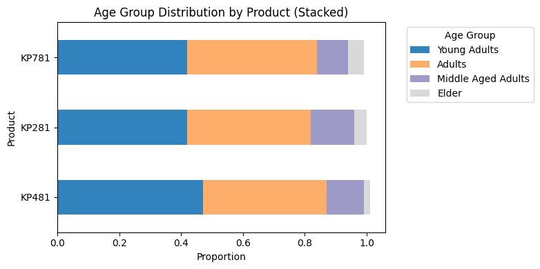
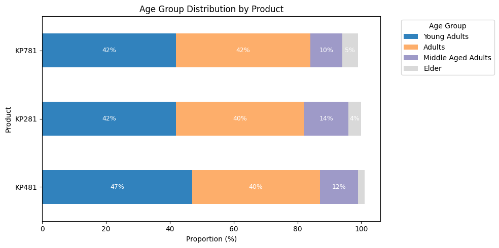
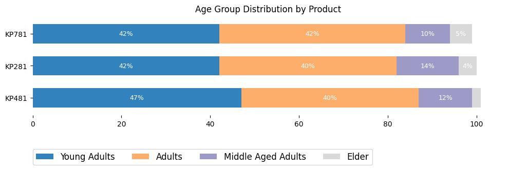

```python
import pandas as pd
import matplotlib.pyplot as plt

# Example pivoted data (if not already pivoted)
df = pd.DataFrame({
    'Young Adults': [0.42, 0.47, 0.42],
    'Adults': [0.40, 0.40, 0.42],
    'Middle Aged Adults': [0.14, 0.12, 0.10],
    'Elder': [0.04, 0.02, 0.05]
}, index=['KP281', 'KP481', 'KP781'])

# Sort rows by total proportion of Young Adults (or any logic)
df_sorted = df.sort_values(by='Young Adults', ascending=False)

# Plot horizontal stacked bar
ax = df_sorted.plot(kind='barh', stacked=True, figsize=(8, 4), colormap='tab20c')

# Formatting
plt.xlabel("Proportion")
plt.ylabel("Product")
plt.title("Age Group Distribution by Product (Stacked)")
plt.legend(title="Age Group", bbox_to_anchor=(1.05, 1), loc='upper left')
plt.tight_layout()
plt.show()

```


    

    


```python
import pandas as pd
import matplotlib.pyplot as plt

# Sample pivoted data
df = pd.DataFrame({
    'Young Adults': [0.42, 0.47, 0.42],
    'Adults': [0.40, 0.40, 0.42],
    'Middle Aged Adults': [0.14, 0.12, 0.10],
    'Elder': [0.04, 0.02, 0.05]
}, index=['KP281', 'KP481', 'KP781'])

# Optional: sort if needed
df = df.sort_values(by='Young Adults', ascending=False)

# Multiply by 100 to get percent values
df_percent = df * 100

# Plot
ax = df_percent.plot(kind='barh', stacked=True, figsize=(10, 5), colormap='tab20c')

# Annotate with values
for i, (index, row) in enumerate(df_percent.iterrows()):
    left = 0
    for col in df_percent.columns:
        width = row[col]
        if width > 3:  # only label if wide enough to avoid clutter
            ax.text(left + width / 2, i, f"{width:.0f}%", va='center', ha='center', color='white', fontsize=9)
        left += width

# Labels and formatting
plt.xlabel("Proportion (%)")
plt.ylabel("Product")
plt.title("Age Group Distribution by Product")
plt.legend(title="Age Group", bbox_to_anchor=(1.05, 1), loc='upper left')
plt.tight_layout()
plt.show()

```


    

    


```python
import pandas as pd
import matplotlib.pyplot as plt

# Sample pivoted data
df = pd.DataFrame({
    'Young Adults': [0.42, 0.47, 0.42],
    'Adults': [0.40, 0.40, 0.42],
    'Middle Aged Adults': [0.14, 0.12, 0.10],
    'Elder': [0.04, 0.02, 0.05]
}, index=['KP281', 'KP481', 'KP781'])

# Optional: sort by a specific group
df = df.sort_values(by='Young Adults', ascending=False)

# Convert proportions to percentages
df_percent = df * 100

# Plot without bar borders (edgecolor) and reduce bar gap (height)
fig, ax = plt.subplots(figsize=(10, 4))
bars = df_percent.plot(kind='barh', stacked=True, ax=ax, colormap='tab20c', edgecolor='none', width=0.6)

# Annotate values inside bars
for i, (index, row) in enumerate(df_percent.iterrows()):
    left = 0
    for col in df_percent.columns:
        value = row[col]
        if value > 3:  # skip small segments
            ax.text(left + value / 2, i, f"{value:.0f}%", ha='center', va='center', color='white', fontsize=9)
        left += value

# Clean look
for s in ['top','left','right','bottom']:
    ax.spines[s].set_visible(False)

# ax.set_xlabel("Proportion (%)")
# ax.set_ylabel("Product")
ax.set_title("Age Group Distribution by Product")
# ax.legend(title="Age Group", bbox_to_anchor=(1.05, 1), loc='lower right')
# ax.legend(title="Age Group", loc='lower right')
ax.legend(loc = (0,-0.5),ncol = 4,fontsize = 12)
plt.tight_layout()
plt.show()

```


    

    


```python
pip install Pyppeteer 
```

    Collecting PyppeteerNote: you may need to restart the kernel to use updated packages.
    

      WARNING: The script pyppeteer-install.exe is installed in 'C:\Users\user\AppData\Local\Programs\Python\Python310\Scripts' which is not on PATH.
      Consider adding this directory to PATH or, if you prefer to suppress this warning, use --no-warn-script-location.
    ERROR: pip's dependency resolver does not currently take into account all the packages that are installed. This behaviour is the source of the following dependency conflicts.
    playwright 1.50.0 requires pyee<13,>=12, but you have pyee 11.1.1 which is incompatible.
    

    
      Downloading pyppeteer-2.0.0-py3-none-any.whl.metadata (7.1 kB)
    Requirement already satisfied: appdirs<2.0.0,>=1.4.3 in c:\users\user\appdata\local\programs\python\python310\lib\site-packages (from Pyppeteer) (1.4.4)
    Collecting certifi>=2023 (from Pyppeteer)
      Downloading certifi-2025.4.26-py3-none-any.whl.metadata (2.5 kB)
    Requirement already satisfied: importlib-metadata>=1.4 in c:\users\user\appdata\local\programs\python\python310\lib\site-packages (from Pyppeteer) (6.8.0)
    Collecting pyee<12.0.0,>=11.0.0 (from Pyppeteer)
      Downloading pyee-11.1.1-py3-none-any.whl.metadata (2.8 kB)
    Requirement already satisfied: tqdm<5.0.0,>=4.42.1 in c:\users\user\appdata\local\programs\python\python310\lib\site-packages (from Pyppeteer) (4.65.0)
    Requirement already satisfied: urllib3<2.0.0,>=1.25.8 in c:\users\user\appdata\local\programs\python\python310\lib\site-packages (from Pyppeteer) (1.26.15)
    Collecting websockets<11.0,>=10.0 (from Pyppeteer)
      Downloading websockets-10.4-cp310-cp310-win_amd64.whl.metadata (6.4 kB)
    Requirement already satisfied: typing-extensions in c:\users\user\appdata\local\programs\python\python310\lib\site-packages (from pyee<12.0.0,>=11.0.0->Pyppeteer) (4.12.2)
    Requirement already satisfied: colorama in c:\users\user\appdata\local\programs\python\python310\lib\site-packages (from tqdm<5.0.0,>=4.42.1->Pyppeteer) (0.4.6)
    Requirement already satisfied: zipp>=0.5 in c:\users\user\appdata\local\programs\python\python310\lib\site-packages (from importlib-metadata>=1.4->Pyppeteer) (3.17.0)
    Downloading pyppeteer-2.0.0-py3-none-any.whl (82 kB)
    Downloading pyee-11.1.1-py3-none-any.whl (15 kB)
    Downloading websockets-10.4-cp310-cp310-win_amd64.whl (101 kB)
    Downloading certifi-2025.4.26-py3-none-any.whl (159 kB)
    Installing collected packages: websockets, pyee, certifi, Pyppeteer
    
       ---------------------------------------- 0/4 [websockets]
       ---------------------------------------- 0/4 [websockets]
       ---------------------------------------- 0/4 [websockets]
      Attempting uninstall: pyee
       ---------------------------------------- 0/4 [websockets]
        Found existing installation: pyee 12.1.1
       ---------------------------------------- 0/4 [websockets]
        Uninstalling pyee-12.1.1:
       ---------------------------------------- 0/4 [websockets]
          Successfully uninstalled pyee-12.1.1
       ---------------------------------------- 0/4 [websockets]
       ---------- ----------------------------- 1/4 [pyee]
      Attempting uninstall: certifi
       ---------- ----------------------------- 1/4 [pyee]
        Found existing installation: certifi 2022.12.7
       ---------- ----------------------------- 1/4 [pyee]
        Uninstalling certifi-2022.12.7:
       ---------- ----------------------------- 1/4 [pyee]
          Successfully uninstalled certifi-2022.12.7
       ---------- ----------------------------- 1/4 [pyee]
       ------------------------------ --------- 3/4 [Pyppeteer]
       ------------------------------ --------- 3/4 [Pyppeteer]
       ------------------------------ --------- 3/4 [Pyppeteer]
       ------------------------------ --------- 3/4 [Pyppeteer]
       ---------------------------------------- 4/4 [Pyppeteer]
    
    Successfully installed Pyppeteer-2.0.0 certifi-2025.4.26 pyee-11.1.1 websockets-10.4
    


```python

```
