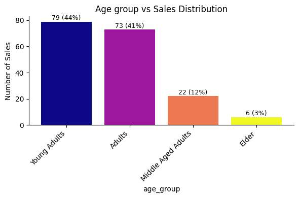
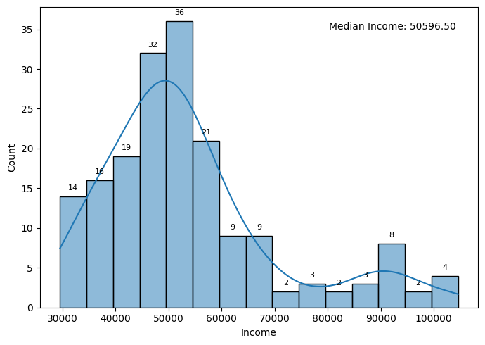

# Business Case: Aerofit -  Descriptive Statistics & Probability

# Introduction

## About Aerofit

AeroFit is a premier brand in the fitness industry, renowned for delivering high-quality, innovative fitness solutions. With a diverse product portfolio that includes state-of-the-art treadmills, exercise bikes, multifunctional gym equipment, and a wide array of fitness accessories, AeroFit is committed to meeting the health and wellness needs of individuals across all age groups and fitness levels. Whether for home use or commercial gym setups, AeroFit products are designed to combine performance, durability, and user-centric features to support every fitness journey.

## Business Objective

The Market Research Team at AeroFit aims to enhance product recommendations for new customers by understanding the distinct customer characteristics associated with each type of treadmill offered by the company. To achieve this, the team intends to explore whether significant demographic or behavioral differences exist among the customers of different treadmill models. This will help in building targeted customer profiles and inform data-driven marketing and sales strategies.


## Dataset Information
The company collected the data on individuals who purchased a treadmill from the AeroFit stores during the prior three months.

The dataset has the following features:

| Feature | Description |
|:--------|:------------|
| Product | Product Purchased:	KP281, KP481, or KP781 |
| Age | Age of buyer in years |
| Gender | Gender of buyer (Male/Female) |
| Education | Education of buyer in years |
| MaritalStatus | MaritalStatus of buyer (Single or partnered) |
| Usage | The average number of times the buyer plans to use the treadmill each week |
| Income | Annual income of the buyer (in $) |
| Fitness | Self-rated fitness on a 1-to-5 scale, where 1 is the poor shape and 5 is the excellent shape |
| Miles | The average number of miles the buyer expects to walk/run each week |
|------------------------------------|------------------------------------------------------------------------------------------------------------------------------------------------------------|


## Product Portfolio

- The `KP281` is an `entry-level` treadmill that sells for `$ 1,500`.


- The `KP481` is for `mid-level` runners that sell for `$ 1,750`.


- The `KP781` treadmill is having `advanced features` that sell for `$ 2,500`.


## Importing Libraries and dataset


```python
import numpy as np
import pandas as pd
import matplotlib.pyplot as plt
from matplotlib import cm
import seaborn as sns
import warnings
warnings.filterwarnings('ignore')
import copy
```


```python
df = pd.read_csv('aerofit_treadmill.txt')
```

# Exploratory Data Analysis


```python
df.head()
```


<div>
<style scoped>
    .dataframe tbody tr th:only-of-type {
        vertical-align: middle;
    }

    .dataframe tbody tr th {
        vertical-align: top;
    }

    .dataframe thead th {
        text-align: right;
    }
</style>
<table border="1" class="dataframe">
  <thead>
    <tr style="text-align: right;">
      <th></th>
      <th>Product</th>
      <th>Age</th>
      <th>Gender</th>
      <th>Education</th>
      <th>MaritalStatus</th>
      <th>Usage</th>
      <th>Fitness</th>
      <th>Income</th>
      <th>Miles</th>
    </tr>
  </thead>
  <tbody>
    <tr>
      <th>0</th>
      <td>KP281</td>
      <td>18</td>
      <td>Male</td>
      <td>14</td>
      <td>Single</td>
      <td>3</td>
      <td>4</td>
      <td>29562</td>
      <td>112</td>
    </tr>
    <tr>
      <th>1</th>
      <td>KP281</td>
      <td>19</td>
      <td>Male</td>
      <td>15</td>
      <td>Single</td>
      <td>2</td>
      <td>3</td>
      <td>31836</td>
      <td>75</td>
    </tr>
    <tr>
      <th>2</th>
      <td>KP281</td>
      <td>19</td>
      <td>Female</td>
      <td>14</td>
      <td>Partnered</td>
      <td>4</td>
      <td>3</td>
      <td>30699</td>
      <td>66</td>
    </tr>
    <tr>
      <th>3</th>
      <td>KP281</td>
      <td>19</td>
      <td>Male</td>
      <td>12</td>
      <td>Single</td>
      <td>3</td>
      <td>3</td>
      <td>32973</td>
      <td>85</td>
    </tr>
    <tr>
      <th>4</th>
      <td>KP281</td>
      <td>20</td>
      <td>Male</td>
      <td>13</td>
      <td>Partnered</td>
      <td>4</td>
      <td>2</td>
      <td>35247</td>
      <td>47</td>
    </tr>
  </tbody>
</table>
</div>


```python
df.tail()
```


<div>
<style scoped>
    .dataframe tbody tr th:only-of-type {
        vertical-align: middle;
    }

    .dataframe tbody tr th {
        vertical-align: top;
    }

    .dataframe thead th {
        text-align: right;
    }
</style>
<table border="1" class="dataframe">
  <thead>
    <tr style="text-align: right;">
      <th></th>
      <th>Product</th>
      <th>Age</th>
      <th>Gender</th>
      <th>Education</th>
      <th>MaritalStatus</th>
      <th>Usage</th>
      <th>Fitness</th>
      <th>Income</th>
      <th>Miles</th>
    </tr>
  </thead>
  <tbody>
    <tr>
      <th>175</th>
      <td>KP781</td>
      <td>40</td>
      <td>Male</td>
      <td>21</td>
      <td>Single</td>
      <td>6</td>
      <td>5</td>
      <td>83416</td>
      <td>200</td>
    </tr>
    <tr>
      <th>176</th>
      <td>KP781</td>
      <td>42</td>
      <td>Male</td>
      <td>18</td>
      <td>Single</td>
      <td>5</td>
      <td>4</td>
      <td>89641</td>
      <td>200</td>
    </tr>
    <tr>
      <th>177</th>
      <td>KP781</td>
      <td>45</td>
      <td>Male</td>
      <td>16</td>
      <td>Single</td>
      <td>5</td>
      <td>5</td>
      <td>90886</td>
      <td>160</td>
    </tr>
    <tr>
      <th>178</th>
      <td>KP781</td>
      <td>47</td>
      <td>Male</td>
      <td>18</td>
      <td>Partnered</td>
      <td>4</td>
      <td>5</td>
      <td>104581</td>
      <td>120</td>
    </tr>
    <tr>
      <th>179</th>
      <td>KP781</td>
      <td>48</td>
      <td>Male</td>
      <td>18</td>
      <td>Partnered</td>
      <td>4</td>
      <td>5</td>
      <td>95508</td>
      <td>180</td>
    </tr>
  </tbody>
</table>
</div>


```python
df.shape
```


    (180, 9)


```python
df.info()
```

    <class 'pandas.core.frame.DataFrame'>
    RangeIndex: 180 entries, 0 to 179
    Data columns (total 9 columns):
     #   Column         Non-Null Count  Dtype 
    ---  ------         --------------  ----- 
     0   Product        180 non-null    object
     1   Age            180 non-null    int64 
     2   Gender         180 non-null    object
     3   Education      180 non-null    int64 
     4   MaritalStatus  180 non-null    object
     5   Usage          180 non-null    int64 
     6   Fitness        180 non-null    int64 
     7   Income         180 non-null    int64 
     8   Miles          180 non-null    int64 
    dtypes: int64(6), object(3)
    memory usage: 12.8+ KB
    

### Insights

- From the above analysis, it is clear that, data has total of 9 features with mixed alpha numeric data. Also we can see that there is no missing data in the columns.


- The data type of all the columns are matching with the data present in them.
But we will change the datatype of Usage and Fitness into str(object).

## Changing the Datatype of Columns

-  Changing the datatype of Usage and Fitness columns


```python
df['Usage'] = df['Usage'].astype('str')
df['Fitness'] = df['Fitness'].astype('str')

df.info()
```

    <class 'pandas.core.frame.DataFrame'>
    RangeIndex: 180 entries, 0 to 179
    Data columns (total 9 columns):
     #   Column         Non-Null Count  Dtype 
    ---  ------         --------------  ----- 
     0   Product        180 non-null    object
     1   Age            180 non-null    int64 
     2   Gender         180 non-null    object
     3   Education      180 non-null    int64 
     4   MaritalStatus  180 non-null    object
     5   Usage          180 non-null    object
     6   Fitness        180 non-null    object
     7   Income         180 non-null    int64 
     8   Miles          180 non-null    int64 
    dtypes: int64(4), object(5)
    memory usage: 12.8+ KB
    

## Statistical Summary


```python
df.describe()
```


<div>
<style scoped>
    .dataframe tbody tr th:only-of-type {
        vertical-align: middle;
    }

    .dataframe tbody tr th {
        vertical-align: top;
    }

    .dataframe thead th {
        text-align: right;
    }
</style>
<table border="1" class="dataframe">
  <thead>
    <tr style="text-align: right;">
      <th></th>
      <th>Age</th>
      <th>Education</th>
      <th>Income</th>
      <th>Miles</th>
    </tr>
  </thead>
  <tbody>
    <tr>
      <th>count</th>
      <td>180.000000</td>
      <td>180.000000</td>
      <td>180.000000</td>
      <td>180.000000</td>
    </tr>
    <tr>
      <th>mean</th>
      <td>28.788889</td>
      <td>15.572222</td>
      <td>53719.577778</td>
      <td>103.194444</td>
    </tr>
    <tr>
      <th>std</th>
      <td>6.943498</td>
      <td>1.617055</td>
      <td>16506.684226</td>
      <td>51.863605</td>
    </tr>
    <tr>
      <th>min</th>
      <td>18.000000</td>
      <td>12.000000</td>
      <td>29562.000000</td>
      <td>21.000000</td>
    </tr>
    <tr>
      <th>25%</th>
      <td>24.000000</td>
      <td>14.000000</td>
      <td>44058.750000</td>
      <td>66.000000</td>
    </tr>
    <tr>
      <th>50%</th>
      <td>26.000000</td>
      <td>16.000000</td>
      <td>50596.500000</td>
      <td>94.000000</td>
    </tr>
    <tr>
      <th>75%</th>
      <td>33.000000</td>
      <td>16.000000</td>
      <td>58668.000000</td>
      <td>114.750000</td>
    </tr>
    <tr>
      <th>max</th>
      <td>50.000000</td>
      <td>21.000000</td>
      <td>104581.000000</td>
      <td>360.000000</td>
    </tr>
  </tbody>
</table>
</div>


<div style="background-color:#f0f8ff; border-radius:10px; padding:15px; border:0px solid #ccc;">
  <span style="font-weight: bold; font-size: 26px;">
Non-graphical analysis
  </span>
</div>

### Insights

**1. Age** - The age range of customers spans from `18 to 50 year`, with an average age of `29 years`.

**2. Education** - Customer education levels vary between `12 and 21 years`, with an average education duration of `16 years`.

**3. Income** -  The annual income of customers falls within the range of `USD 30,000 to USD 100,000`, with an average income of approximately `USD 54,000`.

**4. Miles** -  Customers' weekly running goals range from `21 to 360 miles`, with an average target of `103 miles per week`.


```python
df.describe(include = 'object')
```


<div>
<style scoped>
    .dataframe tbody tr th:only-of-type {
        vertical-align: middle;
    }

    .dataframe tbody tr th {
        vertical-align: top;
    }

    .dataframe thead th {
        text-align: right;
    }
</style>
<table border="1" class="dataframe">
  <thead>
    <tr style="text-align: right;">
      <th></th>
      <th>Product</th>
      <th>Gender</th>
      <th>MaritalStatus</th>
      <th>Usage</th>
      <th>Fitness</th>
    </tr>
  </thead>
  <tbody>
    <tr>
      <th>count</th>
      <td>180</td>
      <td>180</td>
      <td>180</td>
      <td>180</td>
      <td>180</td>
    </tr>
    <tr>
      <th>unique</th>
      <td>3</td>
      <td>2</td>
      <td>2</td>
      <td>6</td>
      <td>5</td>
    </tr>
    <tr>
      <th>top</th>
      <td>KP281</td>
      <td>Male</td>
      <td>Partnered</td>
      <td>3</td>
      <td>3</td>
    </tr>
    <tr>
      <th>freq</th>
      <td>80</td>
      <td>104</td>
      <td>107</td>
      <td>69</td>
      <td>97</td>
    </tr>
  </tbody>
</table>
</div>


### Insights

**1. Usage** -  Customers intend to utilize the product anywhere from `2 to 7 times per week`, with an average usage frequency of `3 times per week`.

**2. Fitness** - On average, customers have rated their fitness at `3` on a 5-point scale, reflecting a `moderate level of fitness`.


```python
product_distribution = pd.crosstab(index=df['Product'], columns='count')
product_percentage_distribution = round((product_distribution / len(df)) * 100,2)

print("Product Distribution:")
print(product_distribution)
print("\nPercentage Distribution:")
print(product_percentage_distribution)
```

    Product Distribution:
    col_0    count
    Product       
    KP281       80
    KP481       60
    KP781       40
    
    Percentage Distribution:
    col_0    count
    Product       
    KP281    44.44
    KP481    33.33
    KP781    22.22
    


```python
gender_distribution = pd.crosstab(index=df['Gender'], columns='count')
gender_percentage_distribution = round((gender_distribution / len(df)) * 100,2)

print("Gender Distribution:")
print(gender_distribution)
print("\nGender - Percentage Distribution:")
print(gender_percentage_distribution)
```

    Gender Distribution:
    col_0   count
    Gender       
    Female     76
    Male      104
    
    Gender - Percentage Distribution:
    col_0   count
    Gender       
    Female  42.22
    Male    57.78
    


```python
MaritalStatus_distribution = pd.crosstab(index=df['MaritalStatus'], columns='count')
MaritalStatus_percentage_distribution = round((MaritalStatus_distribution / len(df)) * 100,2)

print("Gender Distribution:")
print(MaritalStatus_distribution)
print("\nGender - Percentage Distribution:")
print(MaritalStatus_percentage_distribution)
```

    Gender Distribution:
    col_0          count
    MaritalStatus       
    Partnered        107
    Single            73
    
    Gender - Percentage Distribution:
    col_0          count
    MaritalStatus       
    Partnered      59.44
    Single         40.56
    

### Insights

**1. Product** - The `KP281` product demonstrated the `highest sales performance` among the three products, accounting for approximately `44%` of total sales.

**2. Gender** - Around `58%` of the buyers were `Male` and `42%` were `female`

**3. Marital Status** -  Around `60%` of the buyers were `Married` and `40%` were `single`

## Duplicate Detection


```python
df.duplicated().value_counts()
```


    False    180
    Name: count, dtype: int64


### Insights
- There are no duplicate entries in the dataset

## Data Check for columns


```python
for i in df.columns:
    print('Unique Values in',i,'column are :-')
    print(df[i].unique())
    print('-'*70)
    print('Values - Counts in',i,'column are :-')
    print(df[i].value_counts()[:10])
    print('_'*70)
```

    Unique Values in Product column are :-
    ['KP281' 'KP481' 'KP781']
    ----------------------------------------------------------------------
    Values - Counts in Product column are :-
    Product
    KP281    80
    KP481    60
    KP781    40
    Name: count, dtype: int64
    ______________________________________________________________________
    Unique Values in Age column are :-
    [18 19 20 21 22 23 24 25 26 27 28 29 30 31 32 33 34 35 36 37 38 39 40 41
     43 44 46 47 50 45 48 42]
    ----------------------------------------------------------------------
    Values - Counts in Age column are :-
    Age
    25    25
    23    18
    24    12
    26    12
    28     9
    35     8
    33     8
    30     7
    38     7
    21     7
    Name: count, dtype: int64
    ______________________________________________________________________
    Unique Values in Gender column are :-
    ['Male' 'Female']
    ----------------------------------------------------------------------
    Values - Counts in Gender column are :-
    Gender
    Male      104
    Female     76
    Name: count, dtype: int64
    ______________________________________________________________________
    Unique Values in Education column are :-
    [14 15 12 13 16 18 20 21]
    ----------------------------------------------------------------------
    Values - Counts in Education column are :-
    Education
    16    85
    14    55
    18    23
    15     5
    13     5
    12     3
    21     3
    20     1
    Name: count, dtype: int64
    ______________________________________________________________________
    Unique Values in MaritalStatus column are :-
    ['Single' 'Partnered']
    ----------------------------------------------------------------------
    Values - Counts in MaritalStatus column are :-
    MaritalStatus
    Partnered    107
    Single        73
    Name: count, dtype: int64
    ______________________________________________________________________
    Unique Values in Usage column are :-
    ['3' '2' '4' '5' '6' '7']
    ----------------------------------------------------------------------
    Values - Counts in Usage column are :-
    Usage
    3    69
    4    52
    2    33
    5    17
    6     7
    7     2
    Name: count, dtype: int64
    ______________________________________________________________________
    Unique Values in Fitness column are :-
    ['4' '3' '2' '1' '5']
    ----------------------------------------------------------------------
    Values - Counts in Fitness column are :-
    Fitness
    3    97
    5    31
    2    26
    4    24
    1     2
    Name: count, dtype: int64
    ______________________________________________________________________
    Unique Values in Income column are :-
    [ 29562  31836  30699  32973  35247  37521  36384  38658  40932  34110
      39795  42069  44343  45480  46617  48891  53439  43206  52302  51165
      50028  54576  68220  55713  60261  67083  56850  59124  61398  57987
      64809  47754  65220  62535  48658  54781  48556  58516  53536  61006
      57271  52291  49801  62251  64741  70966  75946  74701  69721  83416
      88396  90886  92131  77191  52290  85906 103336  99601  89641  95866
     104581  95508]
    ----------------------------------------------------------------------
    Values - Counts in Income column are :-
    Income
    45480    14
    52302     9
    46617     8
    54576     8
    53439     8
    50028     7
    51165     7
    40932     6
    48891     5
    32973     5
    Name: count, dtype: int64
    ______________________________________________________________________
    Unique Values in Miles column are :-
    [112  75  66  85  47 141 103  94 113  38 188  56 132 169  64  53 106  95
     212  42 127  74 170  21 120 200 140 100  80 160 180 240 150 300 280 260
     360]
    ----------------------------------------------------------------------
    Values - Counts in Miles column are :-
    Miles
    85     27
    95     12
    66     10
    75     10
    47      9
    106     9
    94      8
    113     8
    53      7
    100     7
    Name: count, dtype: int64
    ______________________________________________________________________
    

### Insights

- The dataset does not contain any abnormal values.

## Adding new columns for better analysis


- Adding New Column and Categorizing values in `Age,Education,Income and Miles` to different classes for better visualization

#### Age Column

- Categorizing the values in age column in 4 different buckets:

1. Young Adult: from 18 - 25
2. Adults: from 26 - 35
3. Middle Aged Adults: 36-45
4. Elder :46 and above

#### Education Column

- Categorizing the values in education column in 3 different buckets:

1. Primary Education: upto 12
2. Secondary Education: 13 to 15
3. Higher Education: 16 and above

#### Income Column

- Categorizing the values in Income column in 4 different buckets:

1. Low Income - Upto 40,000
2. Moderate Income - 40,000 to 60,000
3. High Income - 60,000 to 80,000
4. Very High Income - Above 80,000

#### Miles column

- Categorizing the values in miles column in 4 different buckets:

1. Light Activity - Upto 50 miles
2. Moderate Activity - 51 to 100 miles
3. Active Lifestyle - 101 to 200 miles
4. Fitness Enthusiast - Above 200 miles


```python
# Age Grouping
bin_range1 = [17,25,35,45,float('inf')]
bin_labels1 = ['Young Adults', 'Adults', 'Middle Aged Adults', 'Elder']
df['age_group'] = pd.cut(df['Age'],bins = bin_range1,labels = bin_labels1)

# Education Grouping
bin_range2 = [0,12,15,float('inf')]
bin_labels2 = ['Primary Education', 'Secondary Education', 'Higher Education']
df['edu_group'] = pd.cut(df['Education'],bins = bin_range2,labels = bin_labels2)

# Income Grouping
bin_range3 = [0,40000,60000,80000,float('inf')]
bin_labels3 = ['Low Income','Moderate Income','High Income','Very High Income']
df['income_group'] = pd.cut(df['Income'],bins = bin_range3,labels = bin_labels3)

# Age Grouping
bin_range4 = [0,50,100,200,float('inf')]
bin_labels4 = ['Light Activity', 'Moderate Activity', 'Active Lifestyle', 'Fitness Enthusiast ']
df['miles_group'] = pd.cut(df['Miles'],bins = bin_range4,labels = bin_labels4)
```


```python
df.head()
```


<div>
<style scoped>
    .dataframe tbody tr th:only-of-type {
        vertical-align: middle;
    }

    .dataframe tbody tr th {
        vertical-align: top;
    }

    .dataframe thead th {
        text-align: right;
    }
</style>
<table border="1" class="dataframe">
  <thead>
    <tr style="text-align: right;">
      <th></th>
      <th>Product</th>
      <th>Age</th>
      <th>Gender</th>
      <th>Education</th>
      <th>MaritalStatus</th>
      <th>Usage</th>
      <th>Fitness</th>
      <th>Income</th>
      <th>Miles</th>
      <th>age_group</th>
      <th>edu_group</th>
      <th>income_group</th>
      <th>miles_group</th>
    </tr>
  </thead>
  <tbody>
    <tr>
      <th>0</th>
      <td>KP281</td>
      <td>18</td>
      <td>Male</td>
      <td>14</td>
      <td>Single</td>
      <td>3</td>
      <td>4</td>
      <td>29562</td>
      <td>112</td>
      <td>Young Adults</td>
      <td>Secondary Education</td>
      <td>Low Income</td>
      <td>Active Lifestyle</td>
    </tr>
    <tr>
      <th>1</th>
      <td>KP281</td>
      <td>19</td>
      <td>Male</td>
      <td>15</td>
      <td>Single</td>
      <td>2</td>
      <td>3</td>
      <td>31836</td>
      <td>75</td>
      <td>Young Adults</td>
      <td>Secondary Education</td>
      <td>Low Income</td>
      <td>Moderate Activity</td>
    </tr>
    <tr>
      <th>2</th>
      <td>KP281</td>
      <td>19</td>
      <td>Female</td>
      <td>14</td>
      <td>Partnered</td>
      <td>4</td>
      <td>3</td>
      <td>30699</td>
      <td>66</td>
      <td>Young Adults</td>
      <td>Secondary Education</td>
      <td>Low Income</td>
      <td>Moderate Activity</td>
    </tr>
    <tr>
      <th>3</th>
      <td>KP281</td>
      <td>19</td>
      <td>Male</td>
      <td>12</td>
      <td>Single</td>
      <td>3</td>
      <td>3</td>
      <td>32973</td>
      <td>85</td>
      <td>Young Adults</td>
      <td>Primary Education</td>
      <td>Low Income</td>
      <td>Moderate Activity</td>
    </tr>
    <tr>
      <th>4</th>
      <td>KP281</td>
      <td>20</td>
      <td>Male</td>
      <td>13</td>
      <td>Partnered</td>
      <td>4</td>
      <td>2</td>
      <td>35247</td>
      <td>47</td>
      <td>Young Adults</td>
      <td>Secondary Education</td>
      <td>Low Income</td>
      <td>Light Activity</td>
    </tr>
  </tbody>
</table>
</div>


<div style="background-color:#f0f8ff; border-radius:10px; padding:15px; border:0px solid #ccc;">
  <span style="font-weight: bold; font-size: 26px;">
Visualizing - Univariate Analysis
  </span>
</div>

## Defining function for reuse

*   plot_bars_value_and_percentage
*   plot_percentage_bar_horizontal
*   plot_pie_value_and_percentage
*   histplot_with_details
*   boxplot_with_quantiles


```python
def plot_bars_value_and_percentage(df, column, xlabel, ylabel, title, figsize=(10, 6)):

    plt.figure(figsize=figsize)
    ax = plt.subplot()
    value_counts = df[column].value_counts()
    total = len(df)
    num_bars = len(value_counts)

    # Example for colormap (e.g., 'viridis', 'plasma', 'rainbow', 'coolwarm')
    cmap_name = 'plasma'
    cmap = cm.get_cmap(cmap_name, num_bars)
    colors = [cmap(i) for i in range(num_bars)]

    bars = ax.bar(value_counts.index, value_counts.values, color=colors)

    for bar in bars:
        height = bar.get_height()
        percentage = f'{(height / total * 100):.0f}%'
        label_text = f'{int(height)} ({percentage})'
        x = bar.get_x() + bar.get_width() / 2
        y = height + (0.001 * value_counts.max())
        ax.text(x, y, label_text, ha='center', va='bottom', color='black', fontsize=9)

    ax.set_xlabel(xlabel)
    ax.set_ylabel(ylabel)
    plt.title(title)
    plt.xticks(rotation=45, ha='right') # Rotate x-axis labels if needed

    for s in ['top','right']:
      ax.spines[s].set_visible(False)

    plt.tight_layout()
    plt.show()


```


```python
def plot_percentage_bar_horizontal(df, column, figsize=(10, 1), title='Distribution'):
    plt.figure(figsize=figsize)
    ax = plt.subplot()
    total = len(df)
    value_counts = df[column].value_counts()
    percentages = (value_counts / total * 100).round()
    bottom = 0
    for value, percent in percentages.items():
        ax.barh(0, percent, left=bottom)
        ax.text(bottom + percent / 2, 0, f"{value} ({percent:.0f}%)",
                va='center', ha='center', color='white')
        bottom += percent
    ax.set_xlim(0, 100)
    ax.axis('off')
    plt.title(title,color='black')
    plt.tight_layout()
    plt.show()


```


```python
def plot_pie_value_and_percentage(df, column, title, figsize=(4, 4)):
    plt.figure(figsize=figsize)
    ax = plt.subplot()
    value_counts = df[column].value_counts()
    total = len(df)
    num_bars = len(value_counts)

    # Example for colormap (e.g., 'viridis', 'plasma', 'rainbow', 'coolwarm')
    cmap_name = 'viridis'
    cmap = cm.get_cmap(cmap_name, num_bars)
    colors = [cmap(i) for i in range(num_bars)]
    ax.pie(df[column].value_counts().values,labels = df[column].value_counts().index,autopct = '%.1f%%',
    shadow = False,colors = colors) #,wedgeprops = {'linewidth': 5},textprops={'fontsize': 13, 'color': 'black'}

    # plt.title(title)
    plt.title(title,y=-0.2,fontsize=15, fontweight='bold', color='black')
    plt.tight_layout()
    plt.show()

```


```python
def histplot_with_details(df, col, title='Histogram', figsize=(7, 5), color='C0'):
    plt.figure(figsize=figsize)
    ax = sns.histplot(df[col], kde=True, color=color)

    for rect in ax.patches:
        height = rect.get_height()
        if height > 0:
            ax.annotate(f'{int(height)}',
                        xy=(rect.get_x() + rect.get_width() / 2, height),
                        xytext=(0, 5), textcoords='offset points',
                        ha='center', va='bottom', fontsize=8)

    median_val = df[col].median()
    plt.text(0.95, 0.95, f'Median {col}: {median_val:.2f}',
             transform=ax.transAxes, fontsize=10,
             color='black', ha='right', va='top')

    plt.title(title,y=-0.2,fontsize=10, fontweight='bold', color='blue')
    plt.tight_layout()
    plt.show()
```


```python

def boxplot_with_quantiles(df, column, title='', figsize=(8, 2), color='#5C8374'):
    plt.figure(figsize=figsize)
    ax = sns.boxplot(x=df[column], orient='v', color=color)

    for s in ['top', 'left', 'right']:
        ax.spines[s].set_visible(False)

    quantiles = {'Min': df[column].min(),
                 'Q1': df[column].quantile(0.25),'Median': df[column].median(),
                 'Q3': df[column].quantile(0.75),'Max': df[column].max()}

    for label, x in quantiles.items():
        ax.text(x, -0.85, f'{label}\n{x:.1f}', ha='center', va='top', fontsize=8, rotation=0)

    plt.figtext(0.5, -0.05, title, ha='center', va='top', fontsize=10, fontweight='bold', color='blue')
    plt.tight_layout()
    plt.show()


```

## Categorical Variables

###  Product Sales Distribution


```python
# Product vs Sales
plot_bars_value_and_percentage(df, 'Product', 'Product Name', 'Number of Sales', 'Product Sales Breakdown', figsize=(6, 4))
```


    

    


```python
plot_percentage_bar_horizontal(df, 'Product', figsize=(12, 1), title='Product Sales Percentage Distribution')
```


    

    


### Insights

- The KP281 treadmill model, positioned as an entry-level product, has the highest number of units sold, trailed by the KP481 (mid-level) and KP781 (advanced) models.


- All three models have nearly equal contributions in terms of generating sales revenue.


```python
plot_pie_value_and_percentage(df,'Gender','Gender Distribution')
plot_percentage_bar_horizontal(df, 'Gender', figsize=(12, 1), title='Gender Sales Distribution')
```


    

    


    

    


```python
plot_pie_value_and_percentage(df,'MaritalStatus','Marital Status Distribution')
plot_percentage_bar_horizontal(df, 'MaritalStatus', figsize=(12, 1), title='')
```


    

    


    

    


```python
plot_bars_value_and_percentage(df, 'Usage', 'Usage', 'Number of Sales', 'Usage vs Sales Distribution', figsize=(6, 4))
plot_bars_value_and_percentage(df, 'Fitness', 'Fitness', 'Number of Sales', 'Fitness vs Sales Distribution', figsize=(6, 4))
```


    

    


    

    


### Insights

- Almost `85%` of the customers plan to use the treadmill for `2 to 4 times a week` and only 15% using 5 times and above each week


- 54% of the customers have self-evaluated their fitness at a level 3 on a scale of 1 to 5. Furthermore, a substantial 84% of the total customers have rated themselves at 3 or higher, indicating commendable fitness levels.

## Numerical Variables

### Customer Age Distribution


```python
histplot_with_details(df, col='Age', title='Age Distribution')
plot_bars_value_and_percentage(df, 'age_group', 'age_group', 'Number of Sales', 'Age group vs Sales Distribution', figsize=(6, 4))
boxplot_with_quantiles(df, column='Age', title='Age Distribution', figsize=(10, 2))
```


    

    


    

    


    

    


### Insights

- `85%` of the customers fall in the age range of `18 to 35`. with a median age of `26`, suggesting young people showing more interest in the companies products


- **Outliers**
    
     - As we can see from the box plot, there are `3 outlier's` present in the age data.

### Customer Education Distribution


```python
histplot_with_details(df, col='Education', title='')
plot_bars_value_and_percentage(df, 'edu_group', '', 'Number of Sales', '', figsize=(6, 4))
boxplot_with_quantiles(df, column='Education', title='Customer Education Distribution', figsize=(10, 2))
```


    

    


    

    


    

    


### Insights

- `98%` of the customers have education more than 13 years highlighting a strong inclination among well-educated individuals to purchase the products. It's seems that health awareness driven by education could play a pivotal role in this trend.


- **Outliers**
    
     - As we can see from the box plot, there are `2 outlier's` present in the education data.

### Customer Income Distribution


```python
histplot_with_details(df, col='Income', title='')
plot_bars_value_and_percentage(df, 'income_group', '', 'Number of Sales', '', figsize=(6, 4))
boxplot_with_quantiles(df, column='Income', title='Customer Income Distribution', figsize=(10, 2))
```


    

    


    

    


    

    


### Insights

- Almost `60%` of the customers fall in the income group of (40k to 60k) dollars suggesting higher inclination of this income group people towards the products.


- Surprisingly `18%` of the customers fall in the income group of (<40) suggesting almost `77%` of the total customers fall in income group of below 60k and only `23%` of them falling in 60k and above income group


- **Outliers**
    
     - As we can see from the box plot, there are `many outlier's` present in the income data.

###  Customers Expected Weekly Mileage


```python
histplot_with_details(df, col='Miles', title='')
plot_bars_value_and_percentage(df, 'miles_group', '', 'Number of Sales', '', figsize=(6, 4))
boxplot_with_quantiles(df, column='Miles', title='Miles group Distribution', figsize=(10, 2))
```


    

    


    

    


    

    


### Insights

- Almost `88%` of the customers plans to use the treadmill for `50 to 200 miles` per week with a median of `94 miles per week`.


- **Outliers**
    
     - As we can see from the box plot, there are `8 outlier's` present in the miles data.


<div style="background-color:#f0f8ff; border-radius:10px; padding:15px; border:0px solid #ccc;">
  <span style="font-weight: bold; font-size: 26px;">
Visualizing Bi-variate analysis
  </span>
</div>


## Analysis of Product Type


```python
fig = plt.figure(figsize = (15,13))
gs = fig.add_gridspec(2,2)

for i,j,k in [(0,0,'Age'),(0,1,'Education'),(1,0,'Income'),(1,1,'Miles')]:

    ax0 = fig.add_subplot(gs[i,j])

    mp_pal = ["#0d0887", "#cc4778",'#f0f921']
    sns.boxplot(data = df, x = 'Product', y  = k ,ax = ax0,width = 0.5, palette =mp_pal)


    ax0.set_title(f'Product Vs {k}',{'font':'serif', 'size':12,'weight':'bold'})

    ax0.set_xticklabels(df['Product'].unique(),fontweight = 'bold')
    ax0.set_ylabel(f'{k}',fontweight = 'bold',fontsize = 12)
    ax0.set_xlabel('')

plt.show()
```


    

    


### Insights

- The analysis presented above clearly indicates a strong preference for the treadmill model `KP781` among customers who possess higher education, higher income levels, and intend to engage in running activities exceeding 150 miles per week.

## Product Preferences Across Age


```python
def horizontal_stack_bar_percentage(df, column0,columntitle0,column,columntitle,cmap_name = 'plasma'):
    value_counts_product = df[column0].value_counts(normalize=True).mul(100).round(1)
    cross_tab_percentage = pd.crosstab(df[column0], df[column], normalize='index').mul(100).round(1)
    cross_tab_percentage = cross_tab_percentage.sort_index(axis=1)

    num_bars = len(value_counts_product)
    # cmap_name = 'plasma'
    cmap = cm.get_cmap(cmap_name, num_bars)
    colors = [cmap(i) for i in range(num_bars)]

    ax = cross_tab_percentage.plot(kind='barh', figsize=(12, 3), stacked=True,width=0.85,color=colors)

    for container in ax.containers:
        for bar in container:
            width = bar.get_width()
            if width > 0:
                ax.text(bar.get_x() + width / 2, bar.get_y() + bar.get_height() / 2, f'{width:.1f}%',
                        ha='center', va='center', color='white', fontsize=8, rotation=90, )

    for s in ['top', 'left', 'right','bottom']:
        ax.spines[s].set_visible(False)

    plt.title(f'{columntitle0} vs {columntitle}', fontsize=12)
    ax.set_xticklabels([])
    # plt.legend(bbox_to_anchor=(1.0, 1), loc='upper left')
    plt.legend(loc='upper right', bbox_to_anchor=(0.5, -0.1), ncol=12)


    plt.tight_layout()
    plt.show()


```


```python
horizontal_stack_bar_percentage(df, 'Product','Product','age_group','Age Group','plasma')
```


    

    


### Insights

- The analysis provided above distinctly demonstrates that there exists no strong correlation between age groups and product preferences. This is evident from the **nearly uniform distribution of age groups across all the products.**

## Product Preferences Across Education Levels


```python
horizontal_stack_bar_percentage(df, 'Product','Product','edu_group','Education Group','copper')
```


    

    


### Insights

- The analysis provided above cleary demonstrates the preference of `Highly Educated people` for treadmill model `KP781`


- For treadmill models `KP481` and `KP281`, the distribution of customer with `Secondary Education` and with `Higher Education` is almost equal

## Product Preference Across Income Group


```python
horizontal_stack_bar_percentage(df, 'Product','Product','income_group','Income Group','plasma')
```


    

    


### Insights

- Treadmill model `KP781` is preferred more by customers with `Very High Income`


- Both treadmill models, `KP481` and `KP281`, are preferred more by customers with `Moderate Income`

## Product preference across customer weekly mileage


```python
horizontal_stack_bar_percentage(df, 'Product','Product','miles_group','Miles Group','coolwarm')
```


    

    


### Insights

- Treadmill model `KP781` is preferred more by customers planning to run `100 to 200 miles per week`


- Both treadmill models, `KP481` and `KP281`, are preferred more by customers planning to run `50 to 100 miles per week`

## Product Preference across Gender and Marital Status


```python
horizontal_stack_bar_percentage(df, 'Product','Product','Gender','Gender','plasma')
horizontal_stack_bar_percentage(df, 'Product','Product','MaritalStatus','Marital Status','viridis')
```


    

    


    

    


### Insights

**1. Gender**

- Treadmill model `KP781` is preferred more by `male customers`.


- Both treadmill models, `KP481` and `KP281`, show `equal distribution` of both the gender

**2. Marital Status**

- For all the three treadmill models, there is `uniform distribution` of Married and Single customers with **married customers** showing `slighly higher preference`

## Gender vs Product Usage And Gender Vs Fitness


```python
fig = plt.figure(figsize=(12, 5))
gs = fig.add_gridspec(1, 2)

# Usage vs Gender
ax1 = fig.add_subplot(gs[0, 0])
plot1=sns.countplot(data=df, x='Usage', hue='Gender', ax=ax1)

for bar in plot1.patches:
    height = bar.get_height()
    if height > 0:
        plot1.text(bar.get_x() + bar.get_width() / 2, height, f'{int(height)}',
                   ha='center', va='bottom')

ax1.set_title('Usage vs Gender')
ax1.set_xlabel('Usage')
ax1.set_ylabel('Count')

# Fitness vs Gender
ax2 = fig.add_subplot(gs[0, 1])
plot2=sns.countplot(data=df, x='Fitness', hue='Gender', ax=ax2)

for bar in plot2.patches:
    height = bar.get_height()
    if height > 0:
        plot2.text(bar.get_x() + bar.get_width() / 2, height, f'{int(height)}',
                   ha='center', va='bottom')

ax2.set_title('Fitness vs Gender')
ax2.set_xlabel('Fitness')
ax2.set_ylabel('Count')

for s in ['top', 'left', 'right']:
    ax1.spines[s].set_visible(False)
    ax2.spines[s].set_visible(False)

plt.tight_layout()
plt.show()
```


    

    


### Insights

**1. Gender Vs Usage**

- Almost `70% of Female customers` plan to use the treadmill for `2 to 3 times a week` whereas almost `70% of Male customer` plan to use the treadmill for `3 to 4 times a week`

**2. Gender Vs Fitness**

- Almost `80% of Female customers` rated themselves between `2 to 3` whereas almost `90% of Male customer` rated themselves between `3 to 5` on the fitness scale

# Correlation between Variables

## Pairplot


```python
df_copy = copy.deepcopy(df)
```


```python
sns.pairplot(df_copy, hue ='Product')
plt.show()
```


    

    


## Heatmap


```python
df_copy['Usage'] = df_copy['Usage'].astype('int')
df_copy['Fitness'] = df_copy['Fitness'].astype('int')

df_copy.info()
```

    <class 'pandas.core.frame.DataFrame'>
    RangeIndex: 180 entries, 0 to 179
    Data columns (total 13 columns):
     #   Column         Non-Null Count  Dtype   
    ---  ------         --------------  -----   
     0   Product        180 non-null    object  
     1   Age            180 non-null    int64   
     2   Gender         180 non-null    object  
     3   Education      180 non-null    int64   
     4   MaritalStatus  180 non-null    object  
     5   Usage          180 non-null    int32   
     6   Fitness        180 non-null    int32   
     7   Income         180 non-null    int64   
     8   Miles          180 non-null    int64   
     9   age_group      180 non-null    category
     10  edu_group      180 non-null    category
     11  income_group   180 non-null    category
     12  miles_group    180 non-null    category
    dtypes: category(4), int32(2), int64(4), object(3)
    memory usage: 12.8+ KB
    


```python
corr_mat = df_copy.select_dtypes(include=np.number).corr()
plt.figure(figsize=(15,6))
sns.heatmap(corr_mat,annot = True)
plt.show()
```


    

    


### Insights


- From the pair plot we can see `Age and Income` are **positively correlated** and heatmap also suggests a **strong correlation** betwwen them


- `Eductaion` and `Income` are highly correlated as its obvious. Eductation also has significatnt correlation between `Fitness rating and Usage of the treadmill.`


- `Usage` is highly correlated with `Fitness and Miles` as more the usage more the fitness and mileage.

<div style="background-color:#f0f8ff; border-radius:10px; padding:15px; border:0px solid #ccc;">
  <span style="font-weight: bold; font-size: 26px;">
Computing Probability - Marginal, Conditional Probability
  </span>
</div>


## Probability of product purchase w.r.t. gender


```python
pd.crosstab(index =df['Product'],columns = df['Gender'],margins = True,normalize = True ).round(2)
```


<div>
<style scoped>
    .dataframe tbody tr th:only-of-type {
        vertical-align: middle;
    }

    .dataframe tbody tr th {
        vertical-align: top;
    }

    .dataframe thead th {
        text-align: right;
    }
</style>
<table border="1" class="dataframe">
  <thead>
    <tr style="text-align: right;">
      <th>Gender</th>
      <th>Female</th>
      <th>Male</th>
      <th>All</th>
    </tr>
    <tr>
      <th>Product</th>
      <th></th>
      <th></th>
      <th></th>
    </tr>
  </thead>
  <tbody>
    <tr>
      <th>KP281</th>
      <td>0.22</td>
      <td>0.22</td>
      <td>0.44</td>
    </tr>
    <tr>
      <th>KP481</th>
      <td>0.16</td>
      <td>0.17</td>
      <td>0.33</td>
    </tr>
    <tr>
      <th>KP781</th>
      <td>0.04</td>
      <td>0.18</td>
      <td>0.22</td>
    </tr>
    <tr>
      <th>All</th>
      <td>0.42</td>
      <td>0.58</td>
      <td>1.00</td>
    </tr>
  </tbody>
</table>
</div>


### Insights

1. The **`Probability`** of a treadmill being purchased by a **`female is 42%`**.

    - **`The conditional probability`** of purchasing the treadmill model given that the customer is **`female`** is
    
        - For Treadmill model KP281 - **22%**
    
        - For Treadmill model KP481 - **16%**
    
        - For Treadmill model KP781 - **4%**


2. The **`Probability`** of a treadmill being purchased by a **`male is 58%`**.

    - **`The conditional probability`** of purchasing the treadmill model given that the customer is **`male`** is -

        - For Treadmill model KP281 - **22%**
    
        - For Treadmill model KP481 - **17%**
    
        - For Treadmill model KP781 - **18%**

## Probability of product purchase w.r.t. Age


```python
pd.crosstab(index =df['Product'],columns = df['age_group'],margins = True,normalize = True ).round(2)
```


<div>
<style scoped>
    .dataframe tbody tr th:only-of-type {
        vertical-align: middle;
    }

    .dataframe tbody tr th {
        vertical-align: top;
    }

    .dataframe thead th {
        text-align: right;
    }
</style>
<table border="1" class="dataframe">
  <thead>
    <tr style="text-align: right;">
      <th>age_group</th>
      <th>Young Adults</th>
      <th>Adults</th>
      <th>Middle Aged Adults</th>
      <th>Elder</th>
      <th>All</th>
    </tr>
    <tr>
      <th>Product</th>
      <th></th>
      <th></th>
      <th></th>
      <th></th>
      <th></th>
    </tr>
  </thead>
  <tbody>
    <tr>
      <th>KP281</th>
      <td>0.19</td>
      <td>0.18</td>
      <td>0.06</td>
      <td>0.02</td>
      <td>0.44</td>
    </tr>
    <tr>
      <th>KP481</th>
      <td>0.16</td>
      <td>0.13</td>
      <td>0.04</td>
      <td>0.01</td>
      <td>0.33</td>
    </tr>
    <tr>
      <th>KP781</th>
      <td>0.09</td>
      <td>0.09</td>
      <td>0.02</td>
      <td>0.01</td>
      <td>0.22</td>
    </tr>
    <tr>
      <th>All</th>
      <td>0.44</td>
      <td>0.41</td>
      <td>0.12</td>
      <td>0.03</td>
      <td>1.00</td>
    </tr>
  </tbody>
</table>
</div>


### Insights

1. The **`Probability`** of a treadmill being purchased by a **`Young Adult(18-25) is 44%`**.

    - **`The conditional probability`** of purchasing the treadmill model given that the customer is **`Young Adult`** is
    
        - For Treadmill model KP281 - **19%**
    
        - For Treadmill model KP481 - **16%**
    
        - For Treadmill model KP781 - **9%**


2. The **`Probability`** of a treadmill being purchased by a **`Adult(26-35) is 41%`**.

    - **`The conditional probability`** of purchasing the treadmill model given that the customer is **`Adult`** is -

        - For Treadmill model KP281 - **18%**
    
        - For Treadmill model KP481 - **13%**
    
        - For Treadmill model KP781 - **9%**
        
        
3. The **`Probability`** of a treadmill being purchased by a **`Middle Aged(36-45) is 12%`**.
        
        
4. The **`Probability`** of a treadmill being purchased by a **`Elder(Above 45) is only 3%`**.

## Probability of product purchase w.r.t. Education level


```python
pd.crosstab(index =df['Product'],columns = df['edu_group'],margins = True,normalize = True ).round(2)
```


<div>
<style scoped>
    .dataframe tbody tr th:only-of-type {
        vertical-align: middle;
    }

    .dataframe tbody tr th {
        vertical-align: top;
    }

    .dataframe thead th {
        text-align: right;
    }
</style>
<table border="1" class="dataframe">
  <thead>
    <tr style="text-align: right;">
      <th>edu_group</th>
      <th>Primary Education</th>
      <th>Secondary Education</th>
      <th>Higher Education</th>
      <th>All</th>
    </tr>
    <tr>
      <th>Product</th>
      <th></th>
      <th></th>
      <th></th>
      <th></th>
    </tr>
  </thead>
  <tbody>
    <tr>
      <th>KP281</th>
      <td>0.01</td>
      <td>0.21</td>
      <td>0.23</td>
      <td>0.44</td>
    </tr>
    <tr>
      <th>KP481</th>
      <td>0.01</td>
      <td>0.14</td>
      <td>0.18</td>
      <td>0.33</td>
    </tr>
    <tr>
      <th>KP781</th>
      <td>0.00</td>
      <td>0.01</td>
      <td>0.21</td>
      <td>0.22</td>
    </tr>
    <tr>
      <th>All</th>
      <td>0.02</td>
      <td>0.36</td>
      <td>0.62</td>
      <td>1.00</td>
    </tr>
  </tbody>
</table>
</div>


### Insights

1. The **`Probability`** of a treadmill being purchased by a customer with **`Higher Education(Above 15 Years) is 62%`**.

    - **`The conditional probability`** of purchasing the treadmill model given that the customer has **`Higher Education`** is
    
        - For Treadmill model KP281 - **23%**
    
        - For Treadmill model KP481 - **18%**
    
        - For Treadmill model KP781 - **21%**


2. The **`Probability`** of a treadmill being purchased by a customer with **`Secondary Education(13-15 yrs) is 36%`**.

    - **`The conditional probability`** of purchasing the treadmill model given that the customer has **`Secondary Education`** is -

        - For Treadmill model KP281 - **21%**
    
        - For Treadmill model KP481 - **14%**
    
        - For Treadmill model KP781 - **1%**
        
        
3. The **`Probability`** of a treadmill being purchased by a customer with **`Primary Education(0 to 12 yrs) is only 2%`**.

## Probability of product purchase w.r.t. Income


```python
pd.crosstab(index =df['Product'],columns = df['income_group'],margins = True,normalize = True ).round(2)
```


<div>
<style scoped>
    .dataframe tbody tr th:only-of-type {
        vertical-align: middle;
    }

    .dataframe tbody tr th {
        vertical-align: top;
    }

    .dataframe thead th {
        text-align: right;
    }
</style>
<table border="1" class="dataframe">
  <thead>
    <tr style="text-align: right;">
      <th>income_group</th>
      <th>Low Income</th>
      <th>Moderate Income</th>
      <th>High Income</th>
      <th>Very High Income</th>
      <th>All</th>
    </tr>
    <tr>
      <th>Product</th>
      <th></th>
      <th></th>
      <th></th>
      <th></th>
      <th></th>
    </tr>
  </thead>
  <tbody>
    <tr>
      <th>KP281</th>
      <td>0.13</td>
      <td>0.28</td>
      <td>0.03</td>
      <td>0.00</td>
      <td>0.44</td>
    </tr>
    <tr>
      <th>KP481</th>
      <td>0.05</td>
      <td>0.24</td>
      <td>0.04</td>
      <td>0.00</td>
      <td>0.33</td>
    </tr>
    <tr>
      <th>KP781</th>
      <td>0.00</td>
      <td>0.06</td>
      <td>0.06</td>
      <td>0.11</td>
      <td>0.22</td>
    </tr>
    <tr>
      <th>All</th>
      <td>0.18</td>
      <td>0.59</td>
      <td>0.13</td>
      <td>0.11</td>
      <td>1.00</td>
    </tr>
  </tbody>
</table>
</div>


### Insights

1. The **`Probability`** of a treadmill being purchased by a customer with **`Low Income(<40k) is 18%`**.

    - **`The conditional probability`** of purchasing the treadmill model given that the customer has **`Low Income`** is  -
        - For Treadmill model KP281 - **13%**
    
        - For Treadmill model KP481 - **5%**
    
        - For Treadmill model KP781 - **0%**
        
        
2. The **`Probability`** of a treadmill being purchased by a customer with **`Moderate Income(40k - 60k) is 59%`**.

    - **`The conditional probability`** of purchasing the treadmill model given that the customer has **`Moderate Income`** is  -
        - For Treadmill model KP281 - **28%**
    
        - For Treadmill model KP481 - **24%**
    
        - For Treadmill model KP781 - **6%**
        

3. The **`Probability`** of a treadmill being purchased by a customer with **`High Income(60k - 80k) is 13%`**

    - **`The conditional probability`** of purchasing the treadmill model given that the customer has **`High Income`** is  -
    
        - For Treadmill model KP281 - **3%**
    
        - For Treadmill model KP481 - **4%**
    
        - For Treadmill model KP781 - **6%**
        
        
4. The **`Probability`** of a treadmill being purchased by a customer with **`Very High Income(>80k) is 11%`**

    - **`The conditional probability`** of purchasing the treadmill model given that the customer has **`High Income`** is  -
    
        - For Treadmill model KP281 - **0%**
    
        - For Treadmill model KP481 - **0%**
    
        - For Treadmill model KP781 - **11%**
        

## Probability of product purchase w.r.t. Marital Status


```python
pd.crosstab(index =df['Product'],columns = df['MaritalStatus'],margins = True,normalize = True ).round(2)
```


<div>
<style scoped>
    .dataframe tbody tr th:only-of-type {
        vertical-align: middle;
    }

    .dataframe tbody tr th {
        vertical-align: top;
    }

    .dataframe thead th {
        text-align: right;
    }
</style>
<table border="1" class="dataframe">
  <thead>
    <tr style="text-align: right;">
      <th>MaritalStatus</th>
      <th>Partnered</th>
      <th>Single</th>
      <th>All</th>
    </tr>
    <tr>
      <th>Product</th>
      <th></th>
      <th></th>
      <th></th>
    </tr>
  </thead>
  <tbody>
    <tr>
      <th>KP281</th>
      <td>0.27</td>
      <td>0.18</td>
      <td>0.44</td>
    </tr>
    <tr>
      <th>KP481</th>
      <td>0.20</td>
      <td>0.13</td>
      <td>0.33</td>
    </tr>
    <tr>
      <th>KP781</th>
      <td>0.13</td>
      <td>0.09</td>
      <td>0.22</td>
    </tr>
    <tr>
      <th>All</th>
      <td>0.59</td>
      <td>0.41</td>
      <td>1.00</td>
    </tr>
  </tbody>
</table>
</div>


```python
pd.crosstab(index =df['Product'],columns = df['MaritalStatus'],margins = True,normalize = True ).round(2) #.to_csv('abc.csv')
```


<div>
<style scoped>
    .dataframe tbody tr th:only-of-type {
        vertical-align: middle;
    }

    .dataframe tbody tr th {
        vertical-align: top;
    }

    .dataframe thead th {
        text-align: right;
    }
</style>
<table border="1" class="dataframe">
  <thead>
    <tr style="text-align: right;">
      <th>MaritalStatus</th>
      <th>Partnered</th>
      <th>Single</th>
      <th>All</th>
    </tr>
    <tr>
      <th>Product</th>
      <th></th>
      <th></th>
      <th></th>
    </tr>
  </thead>
  <tbody>
    <tr>
      <th>KP281</th>
      <td>0.27</td>
      <td>0.18</td>
      <td>0.44</td>
    </tr>
    <tr>
      <th>KP481</th>
      <td>0.20</td>
      <td>0.13</td>
      <td>0.33</td>
    </tr>
    <tr>
      <th>KP781</th>
      <td>0.13</td>
      <td>0.09</td>
      <td>0.22</td>
    </tr>
    <tr>
      <th>All</th>
      <td>0.59</td>
      <td>0.41</td>
      <td>1.00</td>
    </tr>
  </tbody>
</table>
</div>


### Insights

1. The **`Probability`** of a treadmill being purchased by a **`Married Customer is 59%`**.

    - **`The conditional probability`** of purchasing the treadmill model given that the customer is **`Married`** is
    
        - For Treadmill model KP281 - **27%**
    
        - For Treadmill model KP481 - **20%**
    
        - For Treadmill model KP781 - **13%**


2. The **`Probability`** of a treadmill being purchased by a **`Unmarried Customer is 41%`**.

    - **`The conditional probability`** of purchasing the treadmill model given that the customer is **`Unmarried`** is -

        - For Treadmill model KP281 - **18%**
    
        - For Treadmill model KP481 - **13%**
    
        - For Treadmill model KP781 - **9%**

## Probability of product purchase w.r.t. Weekly Usage


```python
pd.crosstab(index =df['Product'],columns = df['Usage'],margins = True,normalize = True ).round(2)
```


<div>
<style scoped>
    .dataframe tbody tr th:only-of-type {
        vertical-align: middle;
    }

    .dataframe tbody tr th {
        vertical-align: top;
    }

    .dataframe thead th {
        text-align: right;
    }
</style>
<table border="1" class="dataframe">
  <thead>
    <tr style="text-align: right;">
      <th>Usage</th>
      <th>2</th>
      <th>3</th>
      <th>4</th>
      <th>5</th>
      <th>6</th>
      <th>7</th>
      <th>All</th>
    </tr>
    <tr>
      <th>Product</th>
      <th></th>
      <th></th>
      <th></th>
      <th></th>
      <th></th>
      <th></th>
      <th></th>
    </tr>
  </thead>
  <tbody>
    <tr>
      <th>KP281</th>
      <td>0.11</td>
      <td>0.21</td>
      <td>0.12</td>
      <td>0.01</td>
      <td>0.00</td>
      <td>0.00</td>
      <td>0.44</td>
    </tr>
    <tr>
      <th>KP481</th>
      <td>0.08</td>
      <td>0.17</td>
      <td>0.07</td>
      <td>0.02</td>
      <td>0.00</td>
      <td>0.00</td>
      <td>0.33</td>
    </tr>
    <tr>
      <th>KP781</th>
      <td>0.00</td>
      <td>0.01</td>
      <td>0.10</td>
      <td>0.07</td>
      <td>0.04</td>
      <td>0.01</td>
      <td>0.22</td>
    </tr>
    <tr>
      <th>All</th>
      <td>0.18</td>
      <td>0.38</td>
      <td>0.29</td>
      <td>0.09</td>
      <td>0.04</td>
      <td>0.01</td>
      <td>1.00</td>
    </tr>
  </tbody>
</table>
</div>


### Insights

1. The **`Probability`** of a treadmill being purchased by a customer with **`Usage 3 per week is 38%`**.

    - **`The conditional probability`** of purchasing the treadmill model given that the customer has **`Usage 3 per week`** is  -
        - For Treadmill model KP281 - **21%**
    
        - For Treadmill model KP481 - **17%**
    
        - For Treadmill model KP781 - **1%**
        
        
2. The **`Probability`** of a treadmill being purchased by a customer with **`Usage 4 per week is 29%`**.

    - **`The conditional probability`** of purchasing the treadmill model given that the customer has **`Usage 4 per week`** is  -
        - For Treadmill model KP281 - **12%**
    
        - For Treadmill model KP481 - **7%**
    
        - For Treadmill model KP781 - **10%**

3. The **`Probability`** of a treadmill being purchased by a customer with **`Usage 2 per week is 18%`**

    - **`The conditional probability`** of purchasing the treadmill model given that the customer has **`Usage 2 per week`** is  -
        - For Treadmill model KP281 - **11%**
    
        - For Treadmill model KP481 - **8%**
    
        - For Treadmill model KP781 - **0%**
        


## Probability of product purchase w.r.t. Customer Fitness


```python
pd.crosstab(index =df['Product'],columns = df['Fitness'],margins = True,normalize = True ).round(2)
```


<div>
<style scoped>
    .dataframe tbody tr th:only-of-type {
        vertical-align: middle;
    }

    .dataframe tbody tr th {
        vertical-align: top;
    }

    .dataframe thead th {
        text-align: right;
    }
</style>
<table border="1" class="dataframe">
  <thead>
    <tr style="text-align: right;">
      <th>Fitness</th>
      <th>1</th>
      <th>2</th>
      <th>3</th>
      <th>4</th>
      <th>5</th>
      <th>All</th>
    </tr>
    <tr>
      <th>Product</th>
      <th></th>
      <th></th>
      <th></th>
      <th></th>
      <th></th>
      <th></th>
    </tr>
  </thead>
  <tbody>
    <tr>
      <th>KP281</th>
      <td>0.01</td>
      <td>0.08</td>
      <td>0.30</td>
      <td>0.05</td>
      <td>0.01</td>
      <td>0.44</td>
    </tr>
    <tr>
      <th>KP481</th>
      <td>0.01</td>
      <td>0.07</td>
      <td>0.22</td>
      <td>0.04</td>
      <td>0.00</td>
      <td>0.33</td>
    </tr>
    <tr>
      <th>KP781</th>
      <td>0.00</td>
      <td>0.00</td>
      <td>0.02</td>
      <td>0.04</td>
      <td>0.16</td>
      <td>0.22</td>
    </tr>
    <tr>
      <th>All</th>
      <td>0.01</td>
      <td>0.14</td>
      <td>0.54</td>
      <td>0.13</td>
      <td>0.17</td>
      <td>1.00</td>
    </tr>
  </tbody>
</table>
</div>


### Insights

1. The **`Probability`** of a treadmill being purchased by a customer with **`Average(3) Fitness is 54%`**.

    - **`The conditional probability`** of purchasing the treadmill model given that the customer has **`Average Fitness`** is  -
        - For Treadmill model KP281 - **30%**
    
        - For Treadmill model KP481 - **22%**
    
        - For Treadmill model KP781 - **2%**
        

2. The **`Probability`** of a treadmill being purchased by a customer with **`Fitness of 2,4,5 is almost 15%`**.


3. The **`Probability`** of a treadmill being purchased by a customer with **`very low(1) Fitness is only 1%`**.

## Probability of product purchase w.r.t. weekly mileage


```python
pd.crosstab(index =df['Product'],columns = df['miles_group'],margins = True,normalize = True ).round(2)
```


<div>
<style scoped>
    .dataframe tbody tr th:only-of-type {
        vertical-align: middle;
    }

    .dataframe tbody tr th {
        vertical-align: top;
    }

    .dataframe thead th {
        text-align: right;
    }
</style>
<table border="1" class="dataframe">
  <thead>
    <tr style="text-align: right;">
      <th>miles_group</th>
      <th>Light Activity</th>
      <th>Moderate Activity</th>
      <th>Active Lifestyle</th>
      <th>Fitness Enthusiast</th>
      <th>All</th>
    </tr>
    <tr>
      <th>Product</th>
      <th></th>
      <th></th>
      <th></th>
      <th></th>
      <th></th>
    </tr>
  </thead>
  <tbody>
    <tr>
      <th>KP281</th>
      <td>0.07</td>
      <td>0.28</td>
      <td>0.10</td>
      <td>0.00</td>
      <td>0.44</td>
    </tr>
    <tr>
      <th>KP481</th>
      <td>0.03</td>
      <td>0.22</td>
      <td>0.08</td>
      <td>0.01</td>
      <td>0.33</td>
    </tr>
    <tr>
      <th>KP781</th>
      <td>0.00</td>
      <td>0.04</td>
      <td>0.15</td>
      <td>0.03</td>
      <td>0.22</td>
    </tr>
    <tr>
      <th>All</th>
      <td>0.09</td>
      <td>0.54</td>
      <td>0.33</td>
      <td>0.03</td>
      <td>1.00</td>
    </tr>
  </tbody>
</table>
</div>


### Insights

1. The **`Probability`** of a treadmill being purchased by a customer with lifestyle of **`Light Activity(0 to 50 miles/week) is 9%`**.

    - **`The conditional probability`** of purchasing the treadmill model given that the customer has **`Light Activity Lifestyle`** is  -
        
        - For Treadmill model KP281 - **7%**
    
        - For Treadmill model KP481 - **3%**
    
        - For Treadmill model KP781 - **0%**
        
        
2. The **`Probability`** of a treadmill being purchased by a customer with lifestyle of **`Moderate Activity(51 to 100 miles/week) is 54%`**.

    - **`The conditional probability`** of purchasing the treadmill model given that the customer with lifestyle of **`Moderate Activity`** is  -
        - For Treadmill model KP281 - **28%**
    
        - For Treadmill model KP481 - **22%**
    
        - For Treadmill model KP781 - **4%**
        

2. The **`Probability`** of a treadmill being purchased by a customer has **`Active Lifestyle(100 to 200 miles/week) is 33%`**.

    - **`The conditional probability`** of purchasing the treadmill model given that the customer has **`Active Lifestyle`** is  -
        - For Treadmill model KP281 - **10%**
    
        - For Treadmill model KP481 - **8%**
    
        - For Treadmill model KP781 - **15%**
        
        
4. The **`Probability`** of a treadmill being purchased by a customer who is **`Fitness Enthusiast(>200 miles/week) is 3% only`**
        

<div style="background-color:#f0f8ff; border-radius:10px; padding:15px; border:0px solid #ccc;">
  <span style="font-weight: bold; font-size: 26px;">
Customer Profiling
  </span>
</div>

Based on above analysis

- Probability of purchase of KP281 = 44%
- Probability of purchase of KP481 = 33%
- Probability of purchase of KP781 = 22%


- `Customer Profile` for `KP281` Treadmill:

    - Age of customer mainly between 18 to 35 years  with few between 35 to 50 years
    - Education level of customer 13 years and above
    - Annual Income of customer below USD 60,000
    - Weekly Usage - 2 to 4 times
    - Fitness Scale - 2 to 4
    - Weekly Running Mileage - 50 to 100 miles
    
    
- `Customer Profile` for `KP481` Treadmill:

    - Age of customer mainly between 18 to 35 years  with few between 35 to 50 years
    - Education level of customer 13 years and above
    - Annual Income of customer between USD 40,000 to USD 80,000
    - Weekly Usage - 2 to 4 times
    - Fitness Scale - 2 to 4
    - Weekly Running Mileage - 50 to 200 miles


- `Customer Profile` for `KP781` Treadmill:

    - Gender - Male
    - Age of customer between 18 to 35 years
    - Education level of customer 15 years and above
    - Annual Income of customer USD 80,000 and above
    - Weekly Usage - 4 to 7 times
    - Fitness Scale - 3 to 5
    - Weekly Running Mileage - 100 miles and above

<div style="background-color:#f0f8ff; border-radius:10px; padding:15px; border:0px solid #ccc;">
  <span style="font-weight: bold; font-size: 26px;">
Recommendations
  </span>
</div>

**Marketing Campaigns for KP781** 
The KP781 treadmill currently sees a big difference in sales between men and women  with only 18% of sales coming from female customers. To improve this, the company should consider special campaigns aimed at women, such as:

- Exclusive discounts or trial offers for female customers

- Free demo sessions to let them try the treadmill

- Working with female fitness influencers to build trust and interest

These efforts can help attract more women to the product and balance the customer base.

**Affordable Pricing and Easy Payment Options**

For the KP281 and KP481 treadmill models, the typical customer tends to be younger, educated, and has a moderate income. So it's important to:

- Keep the price affordable and competitive

- Offer easy monthly payment plans so customers dont have to pay everything at once

- This makes it easier for more people to buy the treadmill, especially those who are budget-conscious.

**Simple and Helpful App Integration**

To make the treadmill experience more engaging and useful, the company can develop a user-friendly mobile app that works with the treadmill. The app could:

- Track users running or walking progress each week

- Give real-time feedback and motivation during workouts

- Suggest custom workout plans based on the users fitness level and goals

- Connect with other fitness apps like Google Fit or Apple Health
